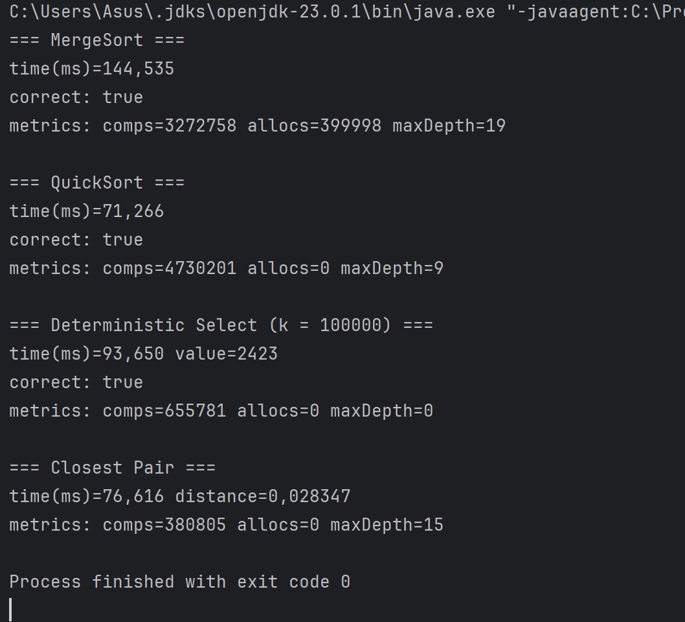

# Design and Analysis of Algorithms – Assignment 1

## Implemented Algorithms
- MergeSort
- QuickSort
- Deterministic Select (Median of Medians)
- Closest Pair of Points

---

## Report
- All algorithms implemented with safe recursion patterns and metrics.
- Recurrence analysis:
    - MergeSort → Θ(n log n)
    - QuickSort → Θ(n log n) average
    - Deterministic Select → Θ(n)
    - Closest Pair → Θ(n log n)

---

## Results
Below is the screenshot showing **all 4 algorithms** with their timings and metrics:

---

## Repository
[GitHub Link](https://github.com/nargizamm001/assig1DAA)  
